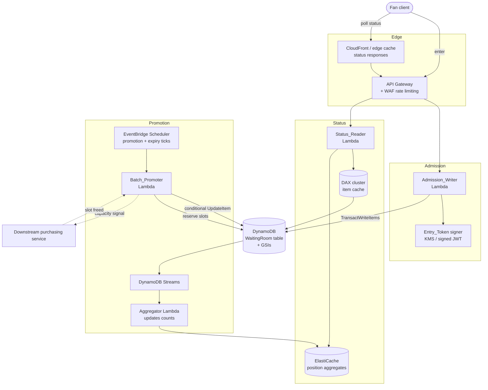
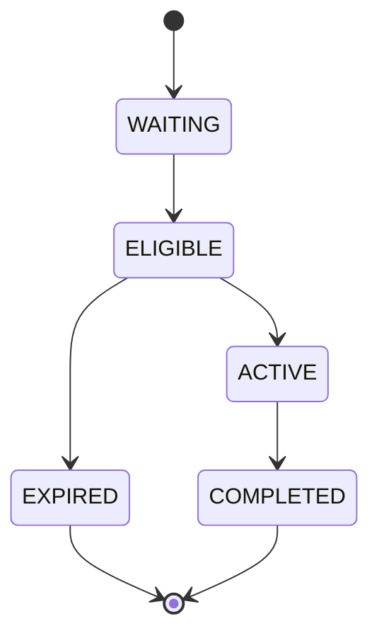

# Design Document: Virtual Waiting Room

## Overview

The Virtual Waiting Room is a DynamoDB-backed system that fairly queues up to **10,000,000 fans arriving within seconds**, assigns each fan a verifiable position, promotes fans from `WAITING` to `ELIGIBLE` in batches bounded by downstream purchasing capacity, and serves low-latency real-time status to millions of concurrent pollers.

The design is organized around four hard problems, each mapped to requirements:

| Problem | Core technique | Requirements |
|---|---|---|
| Absorb a 10M-write burst without hot partitions | Composite partition key with **write sharding** (`Event_Id#Write_Shard`), on-demand capacity, exponential-backoff retries | 2, 9 |
| Assign a **fair, total, deterministic** order | `Ordering_Key` = server monotonic sequence + server random tie-breaker; single authoritative time source; HLC for clock-skew | 3, 4 |
| Promote batches **without over-saturating** downstream | Atomic capacity-counter item with conditional reservation; sparse `WaitingIndex` GSI read in position order; conditional status transitions | 5, 6, 7 |
| Serve **low-latency** status to millions of pollers | Token-encoded key for O(1) `GetItem`; cached approximate position aggregates (DAX / ElastiCache); staleness-bounded caching directive | 8 |
| Keep the **lifecycle** consistent | Conditional-write state machine, reconciliation flag | 10 |

### Submission Deliverables

The challenge requires three artifacts. This spec provides all three, mapped here so a reviewer can locate each:

| # | Required deliverable | Where it lives |
|---|---|---|
| 1 | **NoSQL Workbench data model** (`.json`) — table, GSIs, key schemas, sample data | `.kiro/specs/virtual-waiting-room/nosql-workbench-model.json` (import via NoSQL Workbench → Import data model) |
| 2 | **Design document** explaining *why* each decision was made and the trade-offs accepted | This file — see especially the [Design Decisions and Trade-offs](#design-decisions-and-trade-offs) section |
| 3 | **Access pattern matrix** — every access pattern mapped to table/index, key condition, and filter expression | The [Access Patterns](#access-patterns) section below (full matrix with an explicit Filter Expression column) |

### Key design decisions (summary)

1. **Single-table design** (`WaitingRoom`) holding four item types (queue entry, fan-dedupe guard, capacity counter, event config) that share one bounded context and lifecycle. Justified in the Data Models section.
2. **Write sharding** on the partition key is mandatory: a single `Event_Id` partition caps at 1,000 WCU/s, but the burst demands millions of WCU/s. Spreading across `S` shards yields up to `S × 1,000` WCU/s of *base-table* headroom. `Shard_Count` is **configurable (`CONFIG.Shard_Count`) and burst-driven, not a fixed 1,000** — the sparse `WaitingIndex` GSI (which partitions only by shard) is the real constraint, so production sizing follows the [Scalability and Cost Analysis](#scalability-and-cost-analysis) (≈4,000 shards for a 10M/10s burst). The NoSQL Workbench sample uses `Shard_Count = 1000` purely for illustration.
3. **Exactly-once admission** is enforced with a `TransactWriteItems` that atomically writes the queue entry and a conditional Fan-dedupe guard item keyed by `Event_Id#Fan_Id`.
4. **Over-promotion prevention** is enforced with a single **atomic capacity counter item** updated via a conditional `UpdateItem` that reserves slots before any entry is promoted, so concurrent promoters can never collectively exceed `Downstream_Capacity`.
5. **Position at scale** is served as an **approximate rank** from cached aggregates fed by DynamoDB Streams; an exact count path exists for verification but is never on the hot polling path.

### Research notes informing the design

- **DynamoDB partition limits**: 1,000 WCU/s and 3,000 RCU/s per physical partition. A partition key must therefore reach ~100+ distinct, evenly-loaded values to absorb high write volume. This directly forces the `Event_Id#Write_Shard` key. (AWS DynamoDB developer guide — throughput/partitioning.)
- **On-demand mode** scales without capacity planning but a *new* table still warms up; pre-warming (pre-provisioning then switching, or scheduled scaling) is required before a known flash-sale start time so the first seconds aren't throttled.
- **Sparse GSIs**: an index entry is written only when both index key attributes are present on the item. Removing the `Waiting_Shard` attribute at promotion time evicts the item from the `WaitingIndex`, so the promoter always reads a shrinking set of only-`WAITING` items in position order — no filtering, no scanning.
- **TTL** for eligibility expiry is *best-effort* (delete lag up to 48h), so TTL is used only for garbage collection, never as the authoritative expiry mechanism; an explicit conditional `EXPIRED` transition driven by a scheduled sweep is authoritative.
- **DAX** (DynamoDB Accelerator) provides microsecond read caching that is API-compatible with DynamoDB; **ElastiCache** is used for derived aggregates (approximate position) that are not raw items.

## Architecture

### Component overview



### Request flows

**Admission (burst path)**
1. API Gateway authenticates the caller identity and applies per-identity rate limiting (Req 4.4).
2. `Admission_Writer` derives `Write_Shard = hash(Fan_Id) % ShardCount`, allocates a server `Ordering_Key`, and issues a `TransactWriteItems`:
   - Put the queue entry (`ENTRY#<Ordering_Key>`), condition `attribute_not_exists` on the entry's key.
   - Put the Fan-dedupe guard (`Event_Id#Fan_Id` / `ADMISSION`), condition `attribute_not_exists(PK)`.
3. On success it signs and returns an `Entry_Token` encoding `{Fan_Id, Event_Id, Ordering_Key, Write_Shard}` (Req 1.4).
4. On the dedupe condition failing, it reads the existing guard and returns the existing entry (idempotent — Req 1.3).
5. Throttling triggers exponential backoff with jitter up to a bounded retry limit; exhaustion returns a retryable error with **no** partial write (Req 2.6, 2.7).

**Status (poll path)**
1. `Status_Reader` verifies the `Entry_Token` signature (Req 4.2, 8.5) and derives the exact item key from the token — no scan.
2. It reads the entry through **DAX** (`GetItem`) for status/eligibility, and reads **approximate position** from ElastiCache (Req 8.2, 8.3, 8.8).
3. It attaches a `Cache-Control: max-age=<staleness_bound>` directive so millions of repeat polls are absorbed at the edge without recomputation (Req 8.8).

**Promotion (control path)**
1. EventBridge invokes the `Batch_Promoter` on a fixed cadence (and/or reacts to downstream "slot freed" signals).
2. The promoter reserves `n` slots atomically against the capacity counter (Req 6), then reads the next `n` `WAITING` entries in `Ordering_Key` order from the sparse `WaitingIndex`, merging across shards, and applies conditional `WAITING → ELIGIBLE` transitions (Req 5).
3. DynamoDB Streams feed the `Aggregator` which maintains per-shard `WAITING` counts and global promotion progress used for approximate position.

## Components and Interfaces

### Admission_Writer (Lambda behind API Gateway)
- `admit(event_id, authenticated_identity) -> { entry_token, ordering_key, status } | error`
- Responsibilities: shard assignment, `Ordering_Key` allocation, transactional exactly-once write, token issuance, throttle retry.
- Rejects: event-not-open (`EVENT_NOT_OPEN`), queue-full (`QUEUE_FULL`), rate-limit (`RATE_LIMITED`), retryable throttle exhaustion (`WRITE_RETRYABLE`).

### Ordering_Key allocator (library inside Admission_Writer)
- `next_ordering_key() -> string`
- Produces `<seq>#<tiebreak>` where `seq` is a **Hybrid Logical Clock** value (48-bit physical millis + 16-bit logical counter) rendered as a fixed-width, lexicographically sortable, zero-padded string, and `tiebreak` is a server-generated random token (e.g., 64-bit CSPRNG hex).
- Guarantees monotonic non-decreasing sequence per node even under clock skew (Req 3.1, 3.6); total deterministic order across the event (Req 3.7).

### Batch_Promoter (Lambda, scheduled + event-driven)
- `promote_cycle(event_id) -> { promoted_count, batch_id }`
- `expire_sweep(event_id) -> { expired_count }`
- Reserves capacity, reads next `WAITING` in order across shards, applies conditional transitions, assigns `Batch_Id`, records `Promotion_Time`.

### Capacity counter interface (DynamoDB item + helpers)
- `reserve(event_id, requested) -> granted` — conditional `UpdateItem` that grants `min(requested, remaining)` atomically.
- `release(event_id, count)` — `UpdateItem ADD` on freed slots when entries `COMPLETED`/`EXPIRED` (Req 6, 7).

### Status_Reader (Lambda behind API Gateway + edge cache)
- `get_status(entry_token) -> { position, eligibility_status, estimated_wait, may_browse, reason? } | error`
- Token verification, DAX-backed item read, cached approximate position, caching directive.

### Aggregator (Lambda on DynamoDB Streams)
- Consumes entry inserts/modifies, maintains per-shard `WAITING` counts and global `promoted_progress` in ElastiCache; recomputes `Estimated_Wait_Time` inputs (observed promotion rate).

### Lifecycle manager (library shared by promoter + downstream callbacks)
- `transition(entry_ref, from_status, to_status) -> ok | rejected` — enforces the allowed transition set with conditional writes (Req 10).

## Data Models

### Table choice: single-table, justified

All four item types below belong to **one bounded context** — a single ticket-sale event's queue — and share one operational lifecycle (created at event open, drained at event close, backed up/restored as a unit). They are written together during admission (`TransactWriteItems` over queue entry + dedupe guard) and regulated together during promotion. This satisfies the guidance's test for consolidation: natural parent-child scoping under `Event_Id`, operational coupling, and joint access. A multi-table split would add cross-table transactions and independent backup boundaries with no benefit, so a **single table with an explicit item-type taxonomy** is used.

### `WaitingRoom` table

| PK (`PK`) | SK (`SK`) | Item type | Key attributes |
|---|---|---|---|
| `EVT#<Event_Id>#SH#<shard>` | `ENTRY#<Ordering_Key>` | Queue entry | `Fan_Id`, `Event_Id`, `Write_Shard`, `Entry_Timestamp`, `Eligibility_Status`, `Ordering_Key`, `Batch_Id`, `Promotion_Time`, `Waiting_Shard`, `Elig_PK`, `ttl` |
| `EVT#<Event_Id>#SH#<shard>` | `ADMIT_COUNT` | Sharded admit counter | `Admitted_Count` (atomic `ADD` per admission on this shard) |
| `EVT#<Event_Id>#FAN#<Fan_Id>` | `ADMISSION` | Fan dedupe guard | `Ordering_Key`, `Write_Shard`, `Fan_Id`, `Event_Id` |
| `EVT#<Event_Id>` | `CAPACITY` | Capacity counter | `Downstream_Capacity`, `Eligible_Count`, `Active_Count`, `Promoted_Total`, `Version` |
| `EVT#<Event_Id>` | `CONFIG` | Event config | `Event_Status` (`OPEN`/`CLOSED`), `Shard_Count`, `Max_Queue_Size`, `Eligibility_Window_Secs`, `Max_Batch_Size`, `Active_Target` |

- **Partition Key (`PK`)** — for queue entries, `EVT#<Event_Id>#SH#<shard>`. The `#SH#<shard>` suffix is the **Write_Shard** and is what breaks the hot partition. The base-table ceiling is `Shard_Count × 1,000` WCU/s; at the illustrative `Shard_Count = 1000` that is `1,000,000` WCU/s per event. **The base table is not the binding constraint — the sparse `WaitingIndex` GSI is** (it partitions only by shard, so it sees the full per-shard write rate on a single GSI partition). Production `Shard_Count` is therefore sized by the [Scalability and Cost Analysis](#scalability-and-cost-analysis) (≈4,000 for a 10M/10s burst), and is read from `CONFIG.Shard_Count`. Dedupe guards use `EVT#<Event_Id>#FAN#<Fan_Id>` (extremely high cardinality, one per fan — never hot). Counter/config use `EVT#<Event_Id>` (single item each; updated at promotion cadence, not burst rate — well under 1,000 WCU/s).
- **Sort Key (`SK`)** — for queue entries, `ENTRY#<Ordering_Key>`. Within a shard, entries sort by `Ordering_Key`, so a per-shard `Query` returns fans in position order. Composite string key (base tables do not support multi-attribute keys).
- **Write_Shard assignment** — `shard = hash(Fan_Id) mod Shard_Count`. Hashing on `Fan_Id` (a) distributes evenly (Req 2.2, 9.4), (b) is deterministic, so the shard is recomputable from the token for status reads without storing a shard directory, and (c) is client-independent (Req 4.1).
- **`Ordering_Key`** — `<seq>#<tiebreak>`, fixed-width zero-padded so lexicographic string ordering equals numeric ordering. `seq` = HLC (physical ms + logical counter), `tiebreak` = server CSPRNG. See Fair Positioning below.
- **`ttl`** — Unix epoch; garbage-collects terminal (`EXPIRED`/`COMPLETED`) entries after the event. Never authoritative for expiry logic.
- **Sharded admit counter (`ADMIT_COUNT`)** — one counter item **per write shard** (`PK = EVT#<Event_Id>#SH#<shard>, SK = ADMIT_COUNT`), incremented with an atomic `ADD Admitted_Count :1` **on the same partition as the entry it counts**. It therefore rides the same evenly-distributed shard key as the burst and never becomes a hot item. Total admitted ≈ `Σ Admitted_Count` over all shards, aggregated by the Streams Aggregator into ElastiCache and used for the (approximate) `Max_Queue_Size` gate. See the queue-full decision in [Scalability and Cost Analysis](#scalability-and-cost-analysis). A single global admit counter is deliberately **not** used — it would be a catastrophic hot partition on every one of 10M admissions, contradicting the entire sharding design. This item does not appear in the Workbench sample data but is part of the schema.

### Sample items

```
PK=EVT#e1#SH#042  SK=ENTRY#0000001700000000123#a7f3c2  Fan_Id=f_98a  Eligibility_Status=WAITING  Ordering_Key=0000001700000000123#a7f3c2  Waiting_Shard=EVT#e1#SH#042  Entry_Timestamp=1700000000123
PK=EVT#e1#FAN#f_98a  SK=ADMISSION  Ordering_Key=0000001700000000123#a7f3c2  Write_Shard=042
PK=EVT#e1  SK=CAPACITY  Downstream_Capacity=1000  Eligible_Count=120  Active_Count=860  Promoted_Total=54210  Version=54330
PK=EVT#e1  SK=CONFIG  Event_Status=OPEN  Shard_Count=1000  Max_Queue_Size=10000000  Eligibility_Window_Secs=120  Max_Batch_Size=500  Active_Target=1000
```

> Note: the sample above (and the NoSQL Workbench model) uses `Shard_Count = 1000` **for illustration only**. Production `Shard_Count` is burst-driven and read from `CONFIG.Shard_Count` (≈4,000 for a 10M/10s burst); see [Scalability and Cost Analysis](#scalability-and-cost-analysis).

### Global Secondary Indexes

#### `WaitingIndex` (sparse) — promoter reads next WAITING in position order
- **PK**: `Waiting_Shard` (= `EVT#<Event_Id>#SH#<shard>`, present **only while `Eligibility_Status = WAITING`**)
- **SK**: `Ordering_Key`
- **Projection**: `INCLUDE` (`Fan_Id`, `Entry_Timestamp`) — enough to promote without reading the base item.
- **Sparse mechanism**: `Waiting_Shard` is written on admission and **removed** on the `WAITING → ELIGIBLE`/`EXPIRED` transition, evicting the entry from the index. The promoter therefore always sees a shrinking front-of-line set per shard with no filtering (Req 5.1, 5.6).
- Serves: promotion selection, per-shard position counts.

#### `EligibilityIndex` — capacity accounting, expiry sweep, status-by-status queries
- **PK**: `Elig_PK` (= `EVT#<Event_Id>#<Eligibility_Status>`), present for `ELIGIBLE`/`ACTIVE` entries.
- **SK**: `Promotion_Time` (multi-attribute-capable; used for expiry ordering)
- **Projection**: `INCLUDE` (`Fan_Id`, `Batch_Id`, `Write_Shard`, `Ordering_Key`)
- Serves Req 2.4 (query by event + eligibility status), Req 5.8 (expiry sweep reads oldest `ELIGIBLE` by `Promotion_Time`), reconciliation. The `ELIGIBLE`+`ACTIVE` population is bounded (~capacity, ~1,000), so this low-cardinality PK is never hot.

### Fan_Id lookup / idempotent admission (no GSI needed)
Status reads and dedupe both key on the fan. The `Entry_Token` carries `Ordering_Key` + `Write_Shard`, so a status read is a direct `GetItem` on the base table. Dedupe uses the `EVT#<Event_Id>#FAN#<Fan_Id>` guard item via `GetItem`/conditional `PutItem`. Because both are served by the base table, **no Fan_Id GSI is required** — an identifying-relationship optimization that saves GSI write amplification on the 10M-item burst.

### No Local Secondary Indexes (and why)

This design uses **two GSIs and zero Local Secondary Indexes (LSIs)**. That is a deliberate choice, not an omission:

- **LSIs must be declared at table creation and can never be added later.** A flash-sale table whose indexing needs evolve would be stuck; GSIs can be added/removed on a live table, which matters operationally.
- **An LSI shares the base table's partition key.** Our base partition key is the *write shard* (`EVT#<Event_Id>#SH#<shard>`), chosen to scatter the burst. An LSI could only ever give an alternate sort *within a single shard* — but every meaningful read (next-WAITING in global order, all-ELIGIBLE for an event) is inherently **cross-shard/global**, which only a GSI (with its own partition key) can serve.
- **LSIs impose a 10 GB limit per partition-key value** because the base item and all its LSI projections must live in the same partition. With up to 10M entries per event, a per-partition-key index would risk breaching that ceiling; GSIs have no such collocation limit.
- **LSIs force strongly-consistent-capable but shared throughput with the base table.** Our GSIs (`WaitingIndex`, `EligibilityIndex`) get independent capacity, isolating the promoter's index reads from the admission burst's base-table writes.

For these reasons the access patterns are served by GSIs and token-derived primary-key lookups; no LSI is warranted.

### NoSQL Workbench model
A NoSQL Workbench for DynamoDB–compatible model (DataModel with `WaitingRoom` table, both GSIs, key attributes, non-key attributes, and sample `TableData`) is provided as a concrete deliverable at:

`.kiro/specs/virtual-waiting-room/nosql-workbench-model.json`

Import it via NoSQL Workbench → Import data model to visualize the table, indexes, and sample items.

### Access Patterns

Every access pattern, mapped to table/index, **key condition expression**, **filter expression**, and operation. **No pattern uses a Scan.**

| # | Access Pattern | Table / Index | Key Condition Expression | Filter Expression | Operation | Requirement |
|---|---|---|---|---|---|---|
| 1 | Admit fan (exactly-once) | `WaitingRoom` (entry + guard) | Put entry `PK=EVT#e#SH#s, SK=ENTRY#ok`; put guard `PK=EVT#e#FAN#f, SK=ADMISSION` cond `attribute_not_exists(PK)` | none | `TransactWriteItems` (2 puts, conditional) | 1.1, 2.5, 9.1 |
| 1b | Increment sharded admit counter | `WaitingRoom` (admit counter) | `PK=EVT#e#SH#s AND SK=ADMIT_COUNT`, `ADD Admitted_Count :1` | none | `UpdateItem` (atomic ADD, same shard partition as entry) | 1.6 |
| 1c | Read total admitted (queue-full gate) | ElastiCache aggregate (Streams-fed `Σ ADMIT_COUNT`) | cached `total_admitted` vs `Max_Queue_Size` | none | cache read (exact fallback: `GetItem` per shard, summed) | 1.6 |
| 2 | Dedupe / lookup by Fan_Id | `WaitingRoom` (guard) | `PK=EVT#e#FAN#f AND SK=ADMISSION` | none | `GetItem` | 1.3 |
| 3 | Get status by token | `WaitingRoom` (entry) via DAX | `PK=EVT#e#SH#s AND SK=ENTRY#ok` (from token) | none | `GetItem` | 8.1 |
| 4 | Count WAITING ahead (exact/audit) | `WaitingIndex` per shard | `Waiting_Shard=EVT#e#SH#s AND Ordering_Key < :ok`, `Select=COUNT` | none (sparse index holds only WAITING) | `Query` × Shard_Count, summed | 8.3 |
| 4b | Approximate position (hot path) | ElastiCache aggregates | cached `admission_sequence_rank − Promoted_Total` | none | cache read | 8.3, 8.8 |
| 5 | Next WAITING in position order | `WaitingIndex` per shard | `Waiting_Shard=EVT#e#SH#s ORDER BY Ordering_Key ASC LIMIT n` | none (sparse index holds only WAITING) | `Query` × Shard_Count, k-way merge | 5.1, 5.6 |
| 6 | Query ELIGIBLE/ACTIVE for capacity/expiry | `EligibilityIndex` | `Elig_PK=EVT#e#ELIGIBLE AND Promotion_Time < :cutoff` | none (status encoded in PK) | `Query` | 2.4, 5.8, 6.3 |
| 6b | Read capacity counters | `WaitingRoom` (counter) | `PK=EVT#e AND SK=CAPACITY` | none | `GetItem` | 6.1–6.5 |
| 7 | Reserve downstream slots | `WaitingRoom` (counter) | `PK=EVT#e AND SK=CAPACITY` cond `Eligible_Count+Active_Count+:n <= Downstream_Capacity` | none | `UpdateItem` (atomic ADD, conditional) | 6.1, 6.4 |
| 8 | Promote entry (WAITING→ELIGIBLE) | `WaitingRoom` (entry) | `PK,SK` cond `Eligibility_Status = WAITING`, `REMOVE Waiting_Shard` | none | `UpdateItem` (conditional) | 5.2, 5.5 |
| 9 | Expire eligibility (ELIGIBLE→EXPIRED) | `WaitingRoom` (entry) | `PK,SK` cond `Eligibility_Status = ELIGIBLE` | none | `UpdateItem` (conditional) | 5.8, 10.1 |
| 10 | Activate / complete (ELIGIBLE→ACTIVE→COMPLETED) | `WaitingRoom` (entry) | `PK,SK` cond expected status | none | `UpdateItem` (conditional) | 10.1 |
| 11 | Read event config / open-state | `WaitingRoom` (config) | `PK=EVT#e AND SK=CONFIG` | none | `GetItem` | 1.5, 1.6 |
| 12 | Release freed slot | `WaitingRoom` (counter) | `PK=EVT#e AND SK=CAPACITY` ADD on decrement | none | `UpdateItem` (atomic ADD) | 6.3, 7.5 |

**Filter expressions are deliberately avoided.** Every pattern above resolves entirely through the key condition — either a direct primary-key lookup, a sort-key range, or a sparse/encoded-status GSI partition. This is a design win, not an accident: a `FilterExpression` in DynamoDB is applied *after* items are read from the table or index, so **filtered-out items still consume read capacity**. At 10M queue entries and millions of pollers, filtering would burn RCUs on rows we then discard. By pushing status selection into the key schema (sparse `WaitingIndex`, status-encoded `Elig_PK`) and identity into token-derived keys, the "Filter Expression" column reads `none` across the board and every read pays only for the items it actually returns.

## Design Decisions and Trade-offs

This section states *why* each major decision was made, framed as **decision → alternatives considered → trade-off accepted**. It is the rationale companion to the "what" captured everywhere else in this document.

### 1. Single-table vs multi-table

- **Decision**: One `WaitingRoom` table holding all four item types (queue entry, fan dedupe guard, capacity counter, event config).
- **Alternatives considered**: Separate tables per item type (e.g., `Entries`, `Counters`, `Config`).
- **Trade-off accepted**: A single table cannot express a relational schema and mixes item shapes, which is less self-documenting. In exchange we get **atomic multi-item writes in one `TransactWriteItems`** (entry + dedupe guard), one operational/backup boundary, and no cross-table transaction coordination. All four types share the same `Event_Id` bounded context and the same open→drain→close lifecycle, so the coupling is real and consolidation is the right call.

### 2. Write sharding on the partition key (configurable, burst-driven `Shard_Count`)

- **Decision**: Partition key is `EVT#<Event_Id>#SH#<shard>` with `shard = hash(Fan_Id) mod Shard_Count`, where `Shard_Count` is a **configurable value read from `CONFIG.Shard_Count` and sized from the burst rate** (≈4,000 for a 10M/10s burst — see [Scalability and Cost Analysis](#scalability-and-cost-analysis)).
- **Alternatives considered**: (a) plain `EVT#<Event_Id>` partition key (no sharding); (b) far fewer shards (e.g., 10–50); (c) a fixed 1,000; (d) far more shards (e.g., 10,000).
- **Trade-off accepted**: A single partition caps at 1,000 WCU/s — orders of magnitude short of a 10M-arrival burst — so no-sharding is a non-starter. Sharding lifts the base-table ceiling to `Shard_Count × 1,000` WCU/s. The subtle point (quantified in the Scalability section) is that **the binding constraint is not the base table but the sparse `WaitingIndex` GSI**, which partitions *only* by shard: at 1,000 shards and a 1M-admission/s burst each GSI partition sees ~1,000 WCU/s — exactly the per-partition ceiling, with zero headroom. That is why **`Shard_Count = 1000` is illustrative only** (it is what the NoSQL Workbench sample ships) and production uses ≈4,000 so each GSI partition stays well under ~250–500 WCU/s. The cost is that **sharding destroys global sort order within the table**: entries in position order are spread across `Shard_Count` partitions, so any ordered read (next-WAITING, exact position) becomes a **scatter-gather / k-way merge across all shards**. We accept this because the workload is write-dominated during the burst, while **ordered reads happen only at promotion cadence** (every 1–2s, a bounded `LIMIT n` head-read per shard), *not* on the per-fan hot path. More shards means a larger k-way merge on promotion reads, but promotion is infrequent so the merge fan-out (a few thousand cheap head iterators, a few times per second) is an acceptable price for the write/GSI headroom; too few shards risks throttling the GSI, too many inflates the merge for no throughput benefit beyond the burst requirement.

### 3. Approximate position from cached aggregates vs exact per-request count

- **Decision**: The hot polling path serves an **approximate** position from ElastiCache aggregates (`raw_rank − Promoted_Total`); the exact `COUNT`-across-shards path exists only for audit/verification.
- **Alternatives considered**: Compute exact position on every status poll via `Select=COUNT` queries across all shards.
- **Trade-off accepted**: Exact-on-every-poll would issue `Shard_Count` count-queries per request — at millions of concurrent pollers that is millions × 1000 index reads per polling interval, which neither scales nor stays affordable. The approximate value can lag by up to one aggregation window (**bounded eventual consistency / mild staleness**). We accept staleness because a waiting-room position is inherently an estimate a fan glances at every few seconds; being off by a small, bounded amount for a second is invisible to users and turns an O(Shard_Count) operation into an O(1) cache read. Because promotion is strictly in order, `Promoted_Total` is exactly the count that has left the front, keeping the approximation tight.

### 4. Single atomic capacity counter vs distributed/sharded counters

- **Decision**: One counter item (`PK=EVT#<Event_Id>, SK=CAPACITY`) reserved via a conditional atomic `UpdateItem`.
- **Alternatives considered**: Sharded/distributed counters (N counter items summed) to spread write load, as is standard for high-write counters.
- **Trade-off accepted**: A single item **serializes all reservations** on one partition key, creating a theoretical write-hotspot. In return it gives **exact, race-free capacity enforcement**: the `Eligible_Count + Active_Count + :n <= Downstream_Capacity` condition on a single atomic item makes over-promotion impossible under any concurrency, with no cross-shard reconciliation. Sharded counters would remove the hotspot but reintroduce the exact problem we must not have — approximate sums that can transiently overshoot capacity. The hotspot is a non-issue here because **reservations occur at promotion cadence, not burst rate**: hundreds of reservations/second at most, far under the 1,000 WCU/s single-item limit. Correctness wins, and the write rate never approaches the ceiling.

### 5. On-demand vs provisioned capacity (and pre-warming)

- **Decision**: On-demand (`PAY_PER_REQUEST`) billing, with **pre-warming** ahead of the known flash-sale start time.
- **Alternatives considered**: Provisioned capacity with auto-scaling.
- **Trade-off accepted**: On-demand removes capacity planning and bills per request, but a table (or newly-split partitions) still has a warm-up ramp — a cold on-demand table can throttle the first seconds of an instantaneous 10M burst. Provisioned + auto-scaling reacts too slowly for a sub-10s spike and risks either over-paying for idle steady state or under-provisioning the spike. We accept on-demand's warm-up caveat and **mitigate it deterministically**: because the sale start time is known, we pre-warm (drive synthetic load / pre-provision then switch, or scheduled scaling) so the partitions are already hot when the gate opens. This buys burst absorption without paying for peak capacity year-round.

### 6. HLC + random tie-breaker vs plain timestamp or client-supplied ordering

- **Decision**: `Ordering_Key = <HLC seq>#<server CSPRNG tiebreak>`.
- **Alternatives considered**: (a) plain wall-clock timestamp; (b) client-supplied ordering/sequence.
- **Trade-off accepted**: A plain timestamp breaks under multi-node clock skew (order can invert) and collides on same-millisecond arrivals, and client-supplied ordering is trivially forgeable — a fan could claim position 1. A Hybrid Logical Clock costs a little more logic (physical ms + logical counter) but guarantees a **monotonic, skew-tolerant** sequence, and the server-generated random tie-breaker makes the order a **total, deterministic, unbiasable** ordering that no client can influence. We accept the extra composition cost for fairness and reproducibility that the simpler options cannot provide.

### 7. Sparse GSI (`WaitingIndex`) vs filtering on status

- **Decision**: `WaitingIndex` is sparse — its partition-key attribute `Waiting_Shard` exists **only while `Eligibility_Status = WAITING`** and is `REMOVE`d on promotion/expiry.
- **Alternatives considered**: A dense GSI (or base-table query) over all entries with a `FilterExpression Eligibility_Status = WAITING`.
- **Trade-off accepted**: Maintaining a sparse index requires the writer/promoter to set and later remove `Waiting_Shard` (a little extra write logic on transition). The payoff is large: filtering reads *every* entry and pays RCU for the promoted/expired ones it then discards, so at 10M entries a status filter is wasteful and scales poorly. The sparse index means the promoter reads a **shrinking set of only-`WAITING` items already in position order**, with **no filter and no scan** — each promotion cycle is a cheap head-read per shard. The maintenance cost is trivially repaid on the very first large read.

### 8. TTL as best-effort GC vs authoritative conditional expiry sweep

- **Decision**: Eligibility expiry is enforced by a **scheduled conditional `ELIGIBLE → EXPIRED` sweep**; the `ttl` attribute is used only for best-effort garbage collection of terminal items.
- **Alternatives considered**: Rely on DynamoDB TTL to expire eligibility directly.
- **Trade-off accepted**: DynamoDB TTL is operationally free but **deletes on a best-effort basis with lag of up to 48 hours** — far too imprecise to bound a ~120s eligibility window, and it deletes rather than transitioning (losing the audit trail and the capacity-release hook). The conditional sweep costs a scheduled job and explicit `UpdateItem`s, but gives **precise, authoritative, capacity-aware expiry** exactly at the window boundary. We use both at their strengths: the sweep for correctness, TTL purely to reclaim storage from long-dead terminal items.

### 9. Sharded (approximate) admit counter for queue-full enforcement

- **Decision**: The `Max_Queue_Size` gate (Req 1.6) is enforced against a **sharded admit counter** — one `ADMIT_COUNT` item per write shard, incremented with an atomic `ADD` on the *same* partition as the entry being admitted — with total admitted computed as the aggregated sum of shard counters maintained by the Streams Aggregator in ElastiCache. Enforcement is therefore **approximate**.
- **Alternatives considered**: (a) a single global admit-counter item incremented on every admission; (b) no counter at all (unbounded queue); (c) an exact cross-shard `COUNT` on every admission.
- **Trade-off accepted**: A single global counter would be updated on *every one of 10M admissions* — a catastrophic hot partition that would throttle at 1,000 WCU/s and directly contradict the write-sharding design. An exact per-admission cross-shard count is O(Shard_Count) reads on the hot burst path — unaffordable. The sharded counter rides the already-well-distributed shard key (no new hotspot) and the aggregated total lags by at most one in-flight batch per shard, so the queue may admit **slightly past `Max_Queue_Size`** (bounded by ~one batch × `Shard_Count`). We accept this because **`Max_Queue_Size` is a soft safety valve, not a hard correctness boundary** — being a few entries over an operator-chosen cap has no user-visible or correctness consequence, whereas serializing 10M admissions through one item would break the system. The exact cross-shard sum remains available as an audit/verification path.

## Scalability and Cost Analysis

This section quantifies whether the design holds up at the target burst (**10,000,000 fans arriving within ~10 seconds ⇒ ~1,000,000 admissions/second**). All figures are order-of-magnitude and use on-demand `us-east-1`-style rates; they are labeled **approximate** and are meant to size the design, not to bill it.

### a) Write-burst capacity — the real ceiling is the GSI, not the base table

An earlier draft cited a `1000 shards × 1000 WCU/s = 1,000,000 WCU/s` base-table ceiling as if that settled the burst. It does not. The correct per-admission write cost, counting **all** items and the fact that admission is transactional (transactional writes cost **2× standard WCU**):

| Write target | Item size | Standard WCU | Transactional WCU |
|---|---|---|---|
| Queue entry (`ENTRY#…`) | ~300–400 bytes | 1 | **2** |
| Dedupe guard (`FAN#…/ADMISSION`) | small (< 1 KB) | 1 | **2** |
| `WaitingIndex` GSI projected item | < 1 KB | 1 | ~1 (async GSI replication) |
| **Net per admission** | | | **≈ 5 write units** |

(The sharded `ADMIT_COUNT` increment adds a fractional write amortized onto the shard partition; it does not change the order of magnitude.)

- At **1,000,000 admissions/s**, aggregate write demand ≈ **5,000,000 write units/s**.
- **How that demand fans out across partitions matters more than the aggregate:**
  - **Base `ENTRY` writes** fan out across `Shard_Count` partitions — fine, tune with shard count.
  - **Dedupe `GUARD` writes** fan out across **10M distinct `EVT#e#FAN#f` partitions** — excellent, effectively unlimited distribution, never hot.
  - **`WaitingIndex` GSI writes** fan out **only across `Waiting_Shard = Shard_Count` values.** This is the problem: at `Shard_Count = 1000` and 1,000,000 entries/s, the GSI sees **~1,000 WCU/s per GSI partition — exactly DynamoDB's 1,000 WCU/s per-partition ceiling, with ZERO headroom.** A single hot shard, a burst slightly above 1M/s, or GSI-replication catch-up would throttle.

- **CRITICAL FINDING**: the design's throughput is bounded by the GSI partition, and at the illustrative 1,000 shards there is no safety margin.
- **Recommendation**: **raise `Shard_Count` to create headroom.** For a 10M/10s burst, a default around **`Shard_Count = 4000`** keeps each GSI partition near **~250 WCU/s** (1M/s ÷ 4000), comfortably under the 1,000 WCU/s ceiling even with hot-shard skew and replication lag. Alternatives that also work, individually or combined: spread the burst over a longer admission window (lowering the instantaneous per-partition rate), or reduce GSI write pressure (e.g., defer/omit the sparse index attribute until first promotion read). **Trade-off of more shards**: promotion reads do a larger k-way merge (≈4,000 head iterators instead of 1,000), but promotion runs only every 1–2s and each iterator is a cheap `LIMIT n` head read, so the extra merge cost is negligible and acceptable. `Shard_Count` is configurable via `CONFIG.Shard_Count`; **1,000 was illustrative — the burst rate drives the real number.** The NoSQL Workbench sample keeps `Shard_Count = 1000` for readability; production sizing follows this section.

### b) Cost estimate (order-of-magnitude, approximate)

- **Burst ingestion writes**: 10M admissions × ~5 write request units ≈ **50M WRU**. At ~$1.25 per million WRU ⇒ **≈ $60 one-time** for the entire ingestion. **Writes are cheap.** The burst is a **throughput/partitioning problem, not a cost problem.**
- **Storage**: 10M entries × ~400 bytes ≈ **4 GB** × ~$0.25/GB-month ≈ **≈ $1/month** (plus a similar-order amount for GSI projections). Negligible, and TTL reclaims it after the event.
- **Read / polling is the real cost driver.** 10M fans polling every ~5s ⇒ **≈ 2,000,000 status reads/s**. If every poll hit DynamoDB directly (eventually consistent, ~0.5 RRU each) that is **~1,000,000 RRU/s ≈ ~$0.25/s ≈ ~$900/hour** — and it would blow past read partition limits (3,000 RCU/s per partition) besides being unaffordable. **This is exactly why the DAX + CloudFront/edge cache layer exists.** With a short `Cache-Control: max-age` (a few seconds) absorbing repeat polls at the edge, DynamoDB sees only the tiny fraction that are cache-misses or reflect an item that actually changed — cutting read load and cost by **orders of magnitude** and converting an unservable/unaffordable read load into a bounded one. The **DAX / ElastiCache / CloudFront tier is therefore the dominant recurring cost**, not DynamoDB itself.

| Dimension | Naive cost / load | With this design |
|---|---|---|
| Burst writes | ~$60 one-time (already cheap) | ~$60 one-time; problem is partitioning, solved by `Shard_Count` |
| Storage | ~$1/month + GSI | same; TTL reclaims post-event |
| Status reads | ~2M reads/s → ~1M RRU/s → **~$900/hr + partition-limit breach** | edge/DAX cache absorbs the vast majority → DynamoDB sees a small fraction; cache tier becomes the main (bounded) cost |

### c) Partition-limit summary (does it hold up at scale?)

Per-partition limits: **1,000 WCU/s** (write) and **3,000 RCU/s** (read). Evaluated at the stated burst (1M admissions/s; 2M polls/s) with the **recommended `Shard_Count = 4000`**:

| Write/read target | PK cardinality | Peak per-partition throughput | Within limit? |
|---|---|---|---|
| Entry base (`EVT#e#SH#s`) | `Shard_Count` (4000) | ~1M/s ÷ 4000 × 2 (txn) ≈ **~500 WCU/s** | ✅ under 1,000 WCU/s |
| Dedupe guard (`EVT#e#FAN#f`) | 10M (one per fan) | ~1 write total per partition | ✅ trivially under |
| `WaitingIndex` GSI (`Waiting_Shard`) | `Shard_Count` (4000) | ~1M/s ÷ 4000 ≈ **~250 WCU/s** | ✅ under 1,000 WCU/s (≈1,000 with zero headroom at 1000 shards ❌) |
| `EligibilityIndex` GSI (`Elig_PK`) | small (per-status, bounded ~capacity) | promotion cadence only (hundreds/s) | ✅ far under |
| Capacity counter (`EVT#e/CAPACITY`) | 1 item | promotion cadence only (hundreds/s) | ✅ under 1,000 WCU/s |
| Sharded admit counter (`EVT#e#SH#s/ADMIT_COUNT`) | `Shard_Count` (4000) | ~1M/s ÷ 4000 ≈ **~250 WCU/s** | ✅ under 1,000 WCU/s |
| Status read (token → `GetItem`) | via DAX/edge cache | DynamoDB sees only cache-miss fraction | ✅ under 3,000 RCU/s per partition |

The single row that fails at the illustrative 1,000 shards is the `WaitingIndex` GSI; raising `Shard_Count` to ~4,000 is the fix, and every other target has ample margin.

## Fair Positioning

### Ordering_Key composition
`Ordering_Key = <seq>#<tiebreak>` where:
- `seq` is a **Hybrid Logical Clock (HLC)** value: `physical_ms` (48-bit) concatenated with a per-node `logical_counter` (16-bit) that increments when multiple entries share a physical millisecond. Rendered zero-padded fixed-width so **string sort == chronological order** (Req 3.1).
- `tiebreak` is a server-side CSPRNG token (Req 3.4). It resolves near-simultaneous arrivals (same `seq`) fairly and unpredictably (Req 3.3, 4.5). A fan cannot influence it, so repeated/crafted requests cannot bias position (Req 4.5).

All components are **server-assigned**; any client-supplied position/timestamp/ordering is ignored (Req 4.1). `Entry_Timestamp` comes from a single authoritative server time source (Req 3.5).

### Clock-skew handling
Multiple admission nodes may drift. HLC guarantees that within a node the sequence is monotonic non-decreasing, and across nodes the physical component keeps ordering close to real arrival time. If measured skew between nodes exceeds a configured bound, the logical counter absorbs the difference so admission order is preserved rather than inverted (Req 3.6). Truly simultaneous cross-node arrivals fall back to the random `tiebreak`, which is fair by construction.

### Total, deterministic ordering
For any set of entries, comparison is: compare `seq` lexicographically; if equal, compare `tiebreak`. Because `tiebreak` is a unique random token per entry, no two entries compare equal, so the order is a **total order** and is **deterministic** — recomputing positions over the same set always yields identical results (Req 3.7, 9.5).

### Computing position across shards
`Queue_Position = 1 + count(WAITING entries with Ordering_Key < mine)` (Req 8.3).

Because entries are sharded, an **exact** position requires a `Select=COUNT` query per shard on `WaitingIndex` (`Ordering_Key < mine`) summed across shards. This is correct but O(Shard_Count) per call — unacceptable for millions of pollers.

**Serving position at scale (approximate rank):**
- Define a fan's **admission sequence rank** = its global ordinal among all admitted entries at the instant it was admitted — i.e., how many fans across *all* shards were admitted at or before it in `Ordering_Key` order. The **Aggregator** consumes DynamoDB Streams and maintains a running **global admitted total** bucketed by `Ordering_Key` `seq`; when an entry is admitted, its `seq` falls in the current bucket and the running admitted total at that point **is** its admission sequence rank. That rank is computed once, snapshotted onto the entry (and carried in the `Entry_Token`), and refreshed periodically — it does **not** require any per-poll cross-shard work.
- The Aggregator also tracks the global `Promoted_Total` (the count of entries promoted out of `WAITING`, from the capacity counter). Because **promotion is strictly in `Ordering_Key` order**, `Promoted_Total` is exactly the number of entries that have left the front ahead of everyone still waiting.
- Approximate position is then a single O(1) subtraction served from ElastiCache: `approximate_position = admission_sequence_rank − Promoted_Total`. It is an **estimate bounded by one aggregation window** — the admitted-total and `Promoted_Total` snapshots can each lag by at most one window, so the reported value is off by at most the admissions/promotions within that window, never unboundedly.
- The **exact** path — `Queue_Position = 1 + Σ_shard COUNT(WaitingIndex WHERE Ordering_Key < mine)` — remains available for audit/verification and is what **Property 9** specifies; it is never on the hot poll path.

`Estimated_Wait_Time = position / observed_promotion_rate`, where the rate is a moving average maintained by the Aggregator (Req 8.4).

## Batch Promotion

### Trigger
The `Batch_Promoter` runs on an **EventBridge fixed-cadence tick** (e.g., every 1–2s) and additionally reacts to **downstream "slot freed" signals** for incremental refill (Req 7.3). Stream-driven aggregation keeps counts fresh between ticks.

### Cycle algorithm
1. **Reserve capacity atomically** (see Downstream Over-Promotion Prevention). `granted = reserve(event_id, Max_Batch_Size)`. If `granted == 0`, promote nothing this cycle (Req 5.4, 6.2).
2. **Read next `granted` WAITING entries in order.** For each shard, `Query WaitingIndex (PK=Waiting_Shard) ORDER BY Ordering_Key ASC LIMIT granted`. Merge the `Shard_Count` head iterators with a k-way merge on `Ordering_Key` and take the global first `granted` (Req 5.1, 5.6). Because `WaitingIndex` is sparse and sorted, each shard read is a cheap head read.
3. **Assign `Batch_Id`** (`ULID`/timestamp-based) and apply per-entry conditional transition `WAITING → ELIGIBLE` (below).
4. **Reconcile reservation**: if any per-entry transition fails its condition (already promoted by a racing cycle), `release()` the unused portion so reserved-but-unused slots return to the pool.

### Conditional status transition (per entry)
```
UpdateItem
  Key: {PK, SK}
  UpdateExpression: SET Eligibility_Status=:eligible, Batch_Id=:bid, Promotion_Time=:now,
                    Elig_PK=:eligpk REMOVE Waiting_Shard
  ConditionExpression: Eligibility_Status = :waiting
```
The condition guarantees each entry promotes **at most once** (Req 5.5, idempotent) and `REMOVE Waiting_Shard` evicts it from `WaitingIndex`. Setting `Elig_PK` inserts it into `EligibilityIndex` for capacity/expiry queries.

### Eligibility window / expiry
- Each `ELIGIBLE` entry records `Promotion_Time`. A scheduled `expire_sweep` queries `EligibilityIndex (PK=EVT#<id>#ELIGIBLE) WHERE Promotion_Time < now - window` and applies conditional `ELIGIBLE → EXPIRED`, then `release()`s the slot (Req 5.7, 5.8).
- `ttl` provides best-effort GC of terminal items only; the authoritative expiry is the conditional sweep (TTL lag can be 48h).

## Downstream Over-Promotion Prevention

### Atomic capacity counter
A single item `PK=EVT#<Event_Id>, SK=CAPACITY` holds `Downstream_Capacity`, `Eligible_Count`, `Active_Count`. Reservation is a single conditional `UpdateItem`:
```
UpdateItem
  Key: {EVT#<id>, CAPACITY}
  UpdateExpression: ADD Eligible_Count :n, Promoted_Total :n
  ConditionExpression: Eligible_Count + Active_Count + :n <= Downstream_Capacity
```
- The condition + atomic `ADD` means concurrent promoters serialize on this item; the sum `Eligible_Count + Active_Count` can **never exceed `Downstream_Capacity`** regardless of interleaving (Req 6.1–6.5). 
- To grant a partial batch when `remaining < requested`, the promoter reads `remaining = Downstream_Capacity - (Eligible_Count + Active_Count)` and requests `:n = min(requested, remaining)`; if the conditional write fails due to a concurrent grant, it re-reads and retries with the new remaining (optimistic).
- **Concurrency coordination**: because all reservations funnel through one conditional atomic update on one item, the capacity invariant holds across any number of concurrent promotion cycles (Req 6.4). Update rate on this item is at promotion cadence (hundreds/s at most), far under the 1,000 WCU/s partition limit.
- Transitions `ELIGIBLE → ACTIVE` move a unit from `Eligible_Count` to `Active_Count` (net zero to the sum); `COMPLETED`/`EXPIRED` decrement the appropriate counter, freeing capacity (Req 6.3, 7.5).

## Active-Pool Regulation (Stretch)

When enabled, the promoter treats `Active_Target` (~1,000) as the steady-state goal:
- On each `COMPLETED`/`EXPIRED` (slot freed), `release()` decrements the counter and the next cycle refills incrementally toward the target rather than waiting for the pool to drain (Req 7.2, 7.3, 7.5).
- Refill is bounded by `Downstream_Capacity`: the capacity condition still gates every promotion, so even while chasing the tolerance band the pool can never exceed capacity (Req 7.4, 7.6).
- A tolerance band `[target - δ, target]` avoids thrashing; the capacity condition always wins over the band (Req 7.6).

## Low-Latency Status Reads

- **Token verification first**: the `Entry_Token` is a signed credential (KMS-signed JWT or HMAC). `Status_Reader` verifies the signature before honoring any encoded position (Req 4.2, 8.5); failure returns `AUTH_ERROR` without mutating the entry (Req 4.3).
- **Indexed reads, never scans**: the token yields `{Event_Id, Fan_Id, Ordering_Key, Write_Shard}`, so the entry is fetched with a single `GetItem` through **DAX** (Req 8.2).
- **Approximate position from cache**: position/ETA come from ElastiCache aggregates (Req 8.3, 8.4), not per-request counting.
- **Caching directive**: responses carry `Cache-Control: max-age=<staleness_bound>` so edge caches/CDN absorb repeat polls from millions of fans without recomputation (Req 8.8).
- **Browse gating**: `may_browse = true` only when `Eligibility_Status = ELIGIBLE` AND window not expired AND downstream available; otherwise `may_browse = false` with a `reason` (`EXPIRED` / `DOWNSTREAM_UNAVAILABLE`) (Req 8.6, 8.7).

## Eligibility Lifecycle Integrity

Allowed transitions (Req 10.1):

- Every transition is a conditional `UpdateItem` predicated on the expected current status (Req 10.3), so concurrent transitions cannot corrupt state and an entry always holds exactly one status (Req 10.4).
- Any transition not in the allowed set is rejected and the entry is left unchanged (Req 10.2).
- A failed conditional transition means the expected status did not match: the caller rolls back any side effect (e.g., `release()` a reserved slot) and re-reads authoritative status before retrying (Req 10.5).
- After a transition, the persisted value is validated against the permitted set; an invalid value flags the entry for reconciliation and excludes it from promotion until reconciled (Req 10.6).

## Correctness Properties

*A property is a characteristic or behavior that should hold true across all valid executions of a system — essentially, a formal statement about what the system should do. Properties serve as the bridge between human-readable specifications and machine-verifiable correctness guarantees.*

The properties below were derived from the acceptance-criteria prework and consolidated to remove redundancy. Each is universally quantified and suitable for property-based testing against the pure logic layer (ordering, admission, promotion, capacity, lifecycle) with DynamoDB interactions mocked or run against DynamoDB Local.

### Property 1: Exactly-once admission
*For any* sequence of admission requests — including arbitrary duplicates and concurrent interleavings for the same `Fan_Id` within an `Event` — the system results in **exactly one** `Queue_Entry` for that `(Event_Id, Fan_Id)`, and every duplicate request returns that same entry's `Ordering_Key`.
**Validates: Requirements 1.1, 1.3, 2.5, 4.4, 9.1**

### Property 2: Admission produces a well-formed WAITING entry
*For any* successful admission, the resulting entry contains `Fan_Id`, `Event_Id`, a server `Entry_Timestamp`, an `Ordering_Key`, `Eligibility_Status = WAITING`, a null `Batch_Id`, and is stored under a key of the form `PK = EVT#<Event_Id>#SH#<shard>`, `SK = ENTRY#<Ordering_Key>` retrievable as a single item.
**Validates: Requirements 1.2, 2.1, 2.3**

### Property 3: Entry_Token round-trip and integrity
*For any* claim set `{Fan_Id, Event_Id, Ordering_Key, Write_Shard}`, verifying a freshly signed token recovers exactly those claims; and *for any* single-byte mutation of a signed token, verification fails.
**Validates: Requirements 1.4, 4.2, 4.3, 8.5**

### Property 4: Server-authoritative values ignore client input
*For any* admission request carrying client-supplied `position`, `timestamp`, or `ordering` fields, the assigned `Fan_Id`, `Ordering_Key`, `Entry_Timestamp`, and computed `Queue_Position` are identical to those produced when no such fields are supplied.
**Validates: Requirements 3.5, 4.1**

### Property 5: Write-shard distribution
*For any* large set of distinct `Fan_Id`s and any `Shard_Count`, every assigned `Write_Shard` lies in `[0, Shard_Count)` and the assignment is deterministic per `Fan_Id`, with the population distributed across shards within a bounded deviation of uniform (no shard receives a disproportionate share).
**Validates: Requirements 2.2, 9.4**

### Property 6: Throttle retry is bounded, backed off, and leaves no partial write
*For any* attempt index `k` below the limit, the retry delay lies within `[base·2^k·(1−jitter), base·2^k]`; retries stop at the configured limit; and *for any* run that exhausts retries, no `Queue_Entry` is persisted and the returned error is retryable.
**Validates: Requirements 2.6, 2.7**

### Property 7: Monotonic ordering sequence under clock skew
*For any* stream of admissions processed by a node — including injected clock regressions and cross-node skew beyond the configured bound — the emitted `seq` component of the `Ordering_Key` is monotonically non-decreasing in admission order for that node.
**Validates: Requirements 3.1, 3.6**

### Property 8: Total, deterministic ordering and idempotent position
*For any* set of `Queue_Entries`, the `Ordering_Key` comparator is a strict total order (irreflexive, antisymmetric, transitive, and total — no two distinct entries compare equal because of the unique random tie-breaker), and recomputing `Queue_Position` over the same set any number of times yields identical results.
**Validates: Requirements 3.2, 3.3, 3.7, 9.5**

### Property 9: Position equals one plus fans ahead
*For any* set of `Queue_Entries` and any entry `f`, `Queue_Position(f) = 1 + |{ g : g.Eligibility_Status = WAITING AND g.Ordering_Key < f.Ordering_Key }|`, so the front-most entry holds position 1 and the number of fans ahead equals `Queue_Position − 1`.
**Validates: Requirements 8.3**

### Property 10: Capacity-bounded batch sizing
*For any* queue state with `w` WAITING entries, available remaining capacity `r = Downstream_Capacity − (Eligible_Count + Active_Count)`, and configured `Max_Batch_Size m`, a promotion cycle promotes exactly `min(w, m, max(r, 0))` entries — in particular zero when `r ≤ 0`.
**Validates: Requirements 5.3, 5.4, 6.1, 6.2, 6.3, 6.5**

### Property 11: No over-promotion under concurrency
*For any* interleaving of concurrent promotion cycles issuing atomic capacity reservations, the combined count of `ELIGIBLE` and `ACTIVE` entries never exceeds `Downstream_Capacity` at any point, and any reservation whose per-entry transition later fails releases its slot so no capacity is leaked.
**Validates: Requirements 6.4, 10.5**

### Property 12: Order-preserving promotion
*For any* queue state and any interleaving of promotion cycles, the set of promoted (non-`WAITING`) entries is always a prefix of the total `Ordering_Key` order — every promoted entry has an `Ordering_Key` less than or equal to every still-`WAITING` entry — and the pairwise relative order of any two entries by `Ordering_Key` is preserved across all promotion and status operations.
**Validates: Requirements 5.1, 5.6, 9.3**

### Property 13: Idempotent conditional promotion
*For any* entry, applying a `WAITING → ELIGIBLE` promotion once or repeatedly (including concurrently) results in exactly one successful transition; the entry ends `ELIGIBLE` with a single `Batch_Id` and a recorded `Promotion_Time`, and subsequent promotion attempts are no-ops.
**Validates: Requirements 5.2, 5.5, 5.7, 10.3**

### Property 14: Terminal transitions free capacity
*For any* `ELIGIBLE` entry whose eligibility window has elapsed, an expiry sweep transitions it to `EXPIRED`; and *for any* `ACTIVE → COMPLETED` or `ELIGIBLE → EXPIRED` transition, the freed slot increases available capacity by exactly one.
**Validates: Requirements 5.8, 7.5**

### Property 15: Lifecycle state-machine validity
*For any* transition request `(from, to)`, it succeeds if and only if `(from, to)` is in the allowed set `{WAITING→ELIGIBLE, ELIGIBLE→ACTIVE, ELIGIBLE→EXPIRED, ACTIVE→COMPLETED}`; a disallowed transition leaves the entry unchanged; and after any sequence of operations every entry holds exactly one permitted `Eligibility_Status`.
**Validates: Requirements 10.1, 10.2, 10.4**

### Property 16: Active-pool regulation bounded by capacity
*For any* sequence of completions/expirations and refills with active-pool regulation enabled, the `Active_Fan` count is driven toward the configured target and kept within its tolerance band when capacity permits, and never exceeds `Downstream_Capacity` even when honoring the band would require it — the capacity limit always dominates.
**Validates: Requirements 7.1, 7.2, 7.3, 7.4, 7.6**

### Property 17: Browse gating logic
*For any* status query on an entry, `may_browse` is `true` if and only if `Eligibility_Status = ELIGIBLE` AND the eligibility window has not expired AND downstream browsing is available; when `false`, a `reason` (`EXPIRED` or `DOWNSTREAM_UNAVAILABLE`) is returned.
**Validates: Requirements 8.6, 8.7**

### Property 18: Estimated wait time formula
*For any* `Queue_Position p` and observed promotion rate `ρ > 0`, the returned `Estimated_Wait_Time` equals `p / ρ`.
**Validates: Requirements 8.4**

### Property 19: Cacheable status responses bound staleness
*For any* cacheable status response, the attached caching directive's `max-age` is greater than zero and does not exceed the configured staleness bound.
**Validates: Requirements 8.8**

### Property 20: Admitted entries are durable
*For any* admitted entry and any subsequent sequence of promotion, status, and expiry operations, the entry continues to exist (in some permitted status) and is never dropped.
**Validates: Requirements 9.2**

## Error Handling

| Condition | Detection | Response | Requirement |
|---|---|---|---|
| Event not open | `CONFIG.Event_Status != OPEN` on admit | Reject `EVENT_NOT_OPEN` (no write) | 1.5 |
| Queue full | Aggregated `Σ ADMIT_COUNT` (sharded admit counter, from cache) ≥ `Max_Queue_Size` | Reject `QUEUE_FULL` (no write). **Approximate** gate — may admit slightly past `Max_Queue_Size` by ≤ ~one in-flight batch per shard; acceptable as `Max_Queue_Size` is a soft safety limit, not a hard correctness boundary (see [decision 9](#9-sharded-approximate-admit-counter-for-queue-full-enforcement)) | 1.6 |
| Duplicate admission | Dedupe-guard condition fails | Return existing entry, `200` idempotent | 1.3 |
| Write throttled | `ProvisionedThroughputExceeded` / on-demand throttle | Exponential backoff + jitter, bounded retries | 2.6 |
| Retry exhausted | Retry limit reached | `WRITE_RETRYABLE`, guaranteed no partial write | 2.7 |
| Rate limit exceeded | API Gateway/WAF per-identity limit | Reject `RATE_LIMITED` | 4.4 |
| Invalid/tampered token | Signature verification fails | `AUTH_ERROR`, no state change | 4.3, 8.5 |
| Promotion race lost | Conditional transition fails (status ≠ expected) | Release reserved slot, re-read status, retry/skip | 5.5, 10.5 |
| Capacity exhausted | Reservation condition fails | Promote fewer/zero; retry next cycle | 6.1, 6.2 |
| Eligibility expired | `now − Promotion_Time > window` | Conditional `ELIGIBLE → EXPIRED`, release slot | 5.8 |
| Corrupt/invalid status | Post-transition validation fails | Flag `needs_reconciliation`, exclude from promotion | 10.6 |
| Aggregator lag | Stream iterator age high | Serve last-known cached position (staleness-bounded); reads still correct for status | 8.8 |

Cross-cutting rules:
- **Atomicity**: admission uses `TransactWriteItems`; a failed condition aborts the whole transaction, so an entry never exists without its dedupe guard (Req 2.7, 9.1).
- **No partial side effects**: any control-plane step that reserves capacity before a conditional write must release it on failure (Req 10.5).
- **Idempotency keys**: admission is idempotent on `(Event_Id, Fan_Id)`; promotion is idempotent per entry via the status condition.

## Testing Strategy

### Dual approach
- **Property-based tests** verify the 20 universal properties above against the pure logic layer (Ordering_Key comparator, shard assignment, position computation, batch sizing, capacity reservation model, lifecycle state machine, token codec, backoff schedule) with a minimum of **100 iterations** each.
- **Unit / example tests** cover concrete edge cases and error codes (event closed, queue full at the boundary, zero-capacity cycle, invalid-status reconciliation).
- **Integration tests** (1–3 examples each) run against **DynamoDB Local** to verify wiring that does not vary meaningfully with input: the `EligibilityIndex` returns only matching-status items (Req 2.4), the status path issues only `GetItem`/`Query` and never a `Scan` (Req 8.2), the sparse `WaitingIndex` evicts promoted items, and the `TransactWriteItems` admission behaves atomically.

### PBT applicability
PBT **is** appropriate here: the core is pure logic with large input spaces (arrival streams, key sets, concurrent interleavings) and clear universal invariants (ordering totality, exactly-once, capacity bound, lifecycle validity). The DynamoDB layer itself (index wiring, throughput) is validated by integration/load tests, not PBT.

### Library and configuration
- Pick the idiomatic PBT library for the implementation language (e.g., **fast-check** for TypeScript, **Hypothesis** for Python, **jqwik/QuickTheories** for JVM). Do **not** hand-roll property testing.
- Each property test runs **≥ 100 iterations**.
- Each property test is tagged with a comment referencing its design property, format:
  `Feature: virtual-waiting-room, Property {number}: {property_text}`
- Concurrency properties (11, 12, 13) are tested with a deterministic scheduler / interleaving explorer over a modeled atomic-counter and conditional-write store, so races are reproducible.

### Generators
- **Fan_Id / Event_Id**: random opaque ids; include repeats to exercise dedupe.
- **Arrival streams**: randomized timestamps with injected clock skew and same-millisecond clusters (exercises Properties 7, 8).
- **Queue states**: random mixes of `WAITING/ELIGIBLE/ACTIVE/EXPIRED/COMPLETED` with random `Ordering_Key`s (exercises Properties 9–16).
- **Capacity scenarios**: random `Downstream_Capacity`, `Eligible/Active` counts, `Max_Batch_Size` including boundaries `0`, `= capacity` (exercises Property 10, 11).
- **Tokens**: valid claim sets plus random byte mutations (exercises Property 3).

### Load / burst validation (non-PBT)
- A load test drives up to the burst target against a pre-warmed on-demand table to confirm shard distribution keeps every partition — **including the `WaitingIndex` GSI partition, which is the binding constraint (see [Scalability and Cost Analysis](#scalability-and-cost-analysis))** — under 1,000 WCU/s at the chosen `Shard_Count`, and that no admits are throttled beyond the retry budget (Req 2, 9). This is a performance test, not a property test.
- Capacity and cost are estimated with the DynamoDB capacity/cost tooling once item sizes and RPS are finalized.
