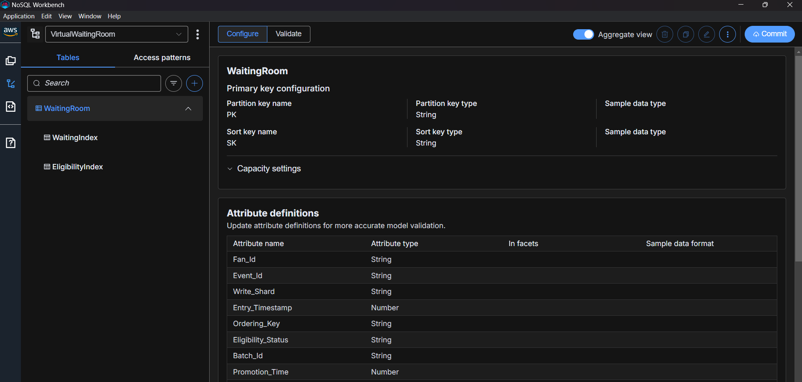
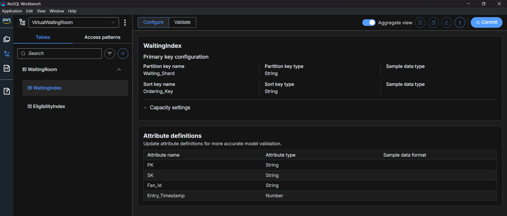
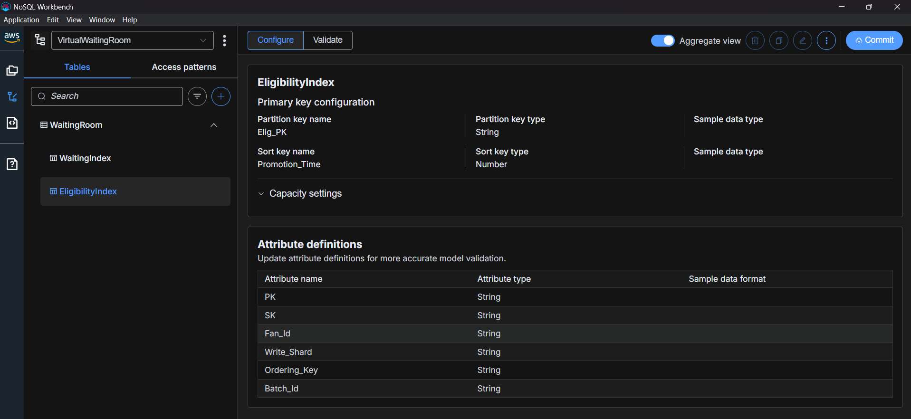

# Virtual Waiting Room (DynamoDB)

A DynamoDB-powered virtual waiting room that fairly queues up to **10,000,000 fans arriving within seconds** for a high-demand ticket sale. It assigns each fan a verifiable queue position, promotes fans from `WAITING` to `ELIGIBLE` in capacity-bounded batches, and serves low-latency real-time status to millions of concurrent pollers.

## Submission deliverables

The three required deliverables live in the [`submission/`](submission) folder:

| # | Deliverable | File |
|---|---|---|
| 1 | **NoSQL Workbench data model** — table, GSIs, key schemas, sample data | [submission/nosql-workbench-model.json](submission/nosql-workbench-model.json) |
| 2 | **Design document** — why each decision was made + trade-offs | [submission/design-document.md](submission/design-document.md) |
| 3 | **Access pattern matrix** — every pattern → table/index, key condition, filter expression | [submission/access-pattern-matrix.md](submission/access-pattern-matrix.md) |

A judge-facing overview is in [submission/README.md](submission/README.md).

## Repository layout

- [`waiting_room/`](waiting_room) — the Python package (pure-logic + DynamoDB data-access layers).
- [`tests/`](tests) — pytest unit, property-based (Hypothesis), and integration (moto) tests.
- [`infra/`](infra) — AWS CDK app (DynamoDB table, Lambdas, HTTP API, scheduled promoter).
- [`scripts/`](scripts) — live smoke, live API, and load-test harnesses.
- [`submission/`](submission) — the challenge deliverables.

## Design in brief

- **Single table `WaitingRoom`** (on-demand) with two GSIs and no LSIs.
- **`WaitingIndex`** (sparse GSI, `Waiting_Shard` / `Ordering_Key`) — front-of-line reads in position order; holds only `WAITING` entries.
- **`EligibilityIndex`** (GSI, `Elig_PK` / `Promotion_Time`) — capacity accounting, expiry sweep, status queries.
- **Fair ordering:** `Ordering_Key = <HLC sequence>#<server random tie-breaker>` (skew-tolerant, gaming-resistant).
- **Exactly-once admission** via `TransactWriteItems` + dedupe guard.
- **No over-promotion** via an atomic capacity counter.
- **Write sharding** with `Shard_Count = 4000` for the 10M-fan burst.

## Screenshots

### 1. NoSQL Workbench — WaitingRoom table & attribute definitions
The imported `WaitingRoom` model showing the base table with its `PK` / `SK` key schema and all attribute definitions.

### 2. WaitingIndex (sparse GSI) — primary key configuration
The `WaitingIndex` GSI: partition key `Waiting_Shard`, sort key `Ordering_Key` (holds only `WAITING` entries for in-order, front-of-line reads).

### 3. EligibilityIndex (GSI) — table & attribute definitions
The `EligibilityIndex` GSI: partition key `Elig_PK`, sort key `Promotion_Time` (used for capacity accounting, the expiry sweep, and status-by-status queries).

