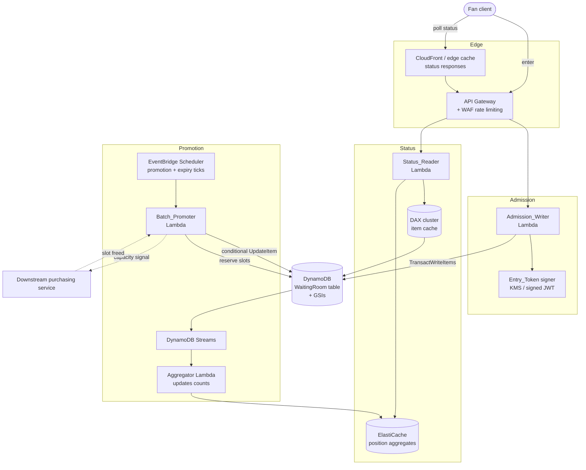

# Design Document — Virtual Waiting Room (DynamoDB)

> Submission deliverable 2 of 3. Companion files: `nosql-workbench-model.json` (data model export) and `access-pattern-matrix.md` (access pattern matrix). This document focuses on **why** each decision was made and the **trade-offs** accepted.

## Overview

The Virtual Waiting Room is a DynamoDB-backed system that fairly queues up to **10,000,000 fans arriving within seconds**, assigns each fan a verifiable position, promotes fans from `WAITING` to `ELIGIBLE` in batches bounded by downstream purchasing capacity, and serves low-latency real-time status to millions of concurrent pollers.

The design is organized around five hard problems, each mapped to a technique:

| Problem | Core technique |
|---|---|
| Absorb a 10M-write burst without hot partitions | Composite partition key with **write sharding** (`Event_Id#Write_Shard`), on-demand capacity, exponential-backoff retries |
| Assign a **fair, total, deterministic** order | `Ordering_Key` = server monotonic sequence (HLC) + server random tie-breaker; single authoritative time source |
| Promote batches **without over-saturating** downstream | Atomic capacity-counter item with conditional reservation; sparse `WaitingIndex` GSI read in position order; conditional status transitions |
| Serve **low-latency** status to millions of pollers | Token-encoded key for O(1) `GetItem`; cached approximate position aggregates (DAX / ElastiCache); staleness-bounded caching directive |
| Keep the **lifecycle** consistent | Conditional-write state machine, reconciliation flag |

## Data Model (summary)

Single table `WaitingRoom` with an explicit item-type taxonomy. Full schema and sample data are in `nosql-workbench-model.json`.

| PK | SK | Item type | Key attributes |
|---|---|---|---|
| `EVT#<Event_Id>#SH#<shard>` | `ENTRY#<Ordering_Key>` | Queue entry | `Fan_Id`, `Event_Id`, `Write_Shard`, `Entry_Timestamp`, `Eligibility_Status`, `Ordering_Key`, `Batch_Id`, `Promotion_Time`, `Waiting_Shard`, `Elig_PK`, `ttl` |
| `EVT#<Event_Id>#SH#<shard>` | `ADMIT_COUNT` | Sharded admit counter | `Admitted_Count` |
| `EVT#<Event_Id>#FAN#<Fan_Id>` | `ADMISSION` | Fan dedupe guard | `Ordering_Key`, `Write_Shard`, `Fan_Id`, `Event_Id` |
| `EVT#<Event_Id>` | `CAPACITY` | Capacity counter | `Downstream_Capacity`, `Eligible_Count`, `Active_Count`, `Promoted_Total`, `Version` |
| `EVT#<Event_Id>` | `CONFIG` | Event config | `Event_Status`, `Shard_Count`, `Max_Queue_Size`, `Eligibility_Window_Secs`, `Max_Batch_Size`, `Active_Target` |

Global Secondary Indexes:
- **`WaitingIndex`** (sparse) — PK `Waiting_Shard`, SK `Ordering_Key`. Present only while an entry is `WAITING`; removed on promotion/expiry so the promoter reads a shrinking, in-order set with no filter.
- **`EligibilityIndex`** — PK `Elig_PK` (`EVT#<Event_Id>#<Status>`), SK `Promotion_Time`. Serves capacity accounting, expiry sweep, and status-by-status queries.

No Local Secondary Indexes — see Decision 10.

## Architecture



## Design Decisions and Trade-offs

Each decision is framed as **decision → alternatives considered → trade-off accepted**.

### 1. Single-table vs multi-table
- **Decision**: One `WaitingRoom` table holding all item types.
- **Alternatives**: Separate tables per item type.
- **Trade-off accepted**: A single table mixes item shapes (less self-documenting) but gives **atomic multi-item writes in one `TransactWriteItems`** (entry + dedupe guard), one operational/backup boundary, and no cross-table transaction coordination. All types share the same `Event_Id` bounded context and open→drain→close lifecycle, so the coupling is real and consolidation is correct.

### 2. Write sharding on the partition key (configurable, burst-driven `Shard_Count`)
- **Decision**: `PK = EVT#<Event_Id>#SH#<shard>`, `shard = hash(Fan_Id) mod Shard_Count`, sized from the burst (~4,000 for 10M/10s).
- **Alternatives**: no sharding; too few shards; a fixed 1,000; too many (10,000+).
- **Trade-off accepted**: A single partition caps at 1,000 WCU/s — far short of the burst — so no-sharding fails immediately. Sharding lifts the base ceiling to `Shard_Count × 1,000` WCU/s. The subtle point (quantified below) is that the **binding constraint is the sparse `WaitingIndex` GSI**, which partitions only by shard; at 1,000 shards and 1M admissions/s each GSI partition sits at the 1,000 WCU/s ceiling with zero headroom, so production uses ~4,000. The cost of sharding is that it **destroys global sort order within the table**, forcing a **scatter-gather / k-way merge** on ordered reads. Acceptable because the burst is write-dominated while ordered reads happen only at promotion cadence (every 1–2s, bounded `LIMIT n` head-reads), never on the per-fan hot path.

### 3. Approximate position from cached aggregates vs exact per-request count
- **Decision**: Hot polling path serves an **approximate** position (`admission_sequence_rank − Promoted_Total`) from ElastiCache; exact `COUNT`-across-shards exists only for audit.
- **Alternatives**: Exact count on every poll.
- **Trade-off accepted**: Exact-on-every-poll issues `Shard_Count` count-queries per request — at millions of pollers, unservable and unaffordable. The approximate value can lag by at most one aggregation window (bounded staleness), which is invisible for a number a fan glances at every few seconds, and turns an O(Shard_Count) operation into an O(1) cache read. Because promotion is strictly in order, `Promoted_Total` is exactly the count that has left the front, keeping the estimate tight.

### 4. Single atomic capacity counter vs distributed/sharded counters
- **Decision**: One counter item (`PK=EVT#<Event_Id>, SK=CAPACITY`) reserved via a conditional atomic `UpdateItem`.
- **Alternatives**: Sharded counters summed (standard high-write-counter pattern).
- **Trade-off accepted**: A single item **serializes reservations** (theoretical hotspot) but gives **exact, race-free capacity enforcement** — the condition `Eligible_Count + Active_Count + :n <= Downstream_Capacity` makes over-promotion impossible under any interleaving. Sharded counters would remove the hotspot but reintroduce the exact defect we cannot have (approximate sums that transiently overshoot capacity). The hotspot is a non-issue: reservations occur at **promotion cadence** (hundreds/s), far under the 1,000 WCU/s single-item limit. Correctness wins.

### 5. On-demand vs provisioned capacity (and pre-warming)
- **Decision**: On-demand (`PAY_PER_REQUEST`) with **pre-warming** ahead of the known sale start.
- **Alternatives**: Provisioned + auto-scaling.
- **Trade-off accepted**: On-demand removes capacity planning but a cold table has a warm-up ramp that could throttle the first seconds of an instantaneous burst. Provisioned auto-scaling reacts too slowly for a sub-10s spike and over-pays at idle. Because the start time is known, we pre-warm (synthetic load / pre-provision then switch) so partitions are hot when the gate opens — burst absorption without paying for peak capacity year-round.

### 6. HLC + random tie-breaker vs plain timestamp or client-supplied ordering
- **Decision**: `Ordering_Key = <HLC seq>#<server CSPRNG tiebreak>`.
- **Alternatives**: plain wall-clock timestamp; client-supplied ordering.
- **Trade-off accepted**: A plain timestamp inverts under multi-node clock skew and collides on same-millisecond arrivals; client-supplied ordering is trivially forgeable. A Hybrid Logical Clock costs a little more logic but guarantees a **monotonic, skew-tolerant** sequence, and the server random tie-breaker makes the order **total, deterministic, and unbiasable** by any client. We accept the extra composition cost for fairness and reproducibility.

### 7. Sparse GSI (`WaitingIndex`) vs filtering on status
- **Decision**: `Waiting_Shard` exists only while `WAITING`; `REMOVE`d on promotion/expiry.
- **Alternatives**: A dense GSI/base query with `FilterExpression Eligibility_Status = WAITING`.
- **Trade-off accepted**: A sparse index needs extra write logic to set/remove the attribute, but a filter reads *every* entry and pays RCU for the promoted/expired rows it discards — wasteful at 10M entries. The sparse index means the promoter reads a **shrinking set of only-`WAITING` items already in order**, no filter, no scan. The maintenance cost is repaid on the first large read.

### 8. TTL as best-effort GC vs authoritative conditional expiry sweep
- **Decision**: Eligibility expiry via a **scheduled conditional `ELIGIBLE→EXPIRED` sweep**; `ttl` only for best-effort GC of terminal items.
- **Alternatives**: Rely on DynamoDB TTL to expire eligibility directly.
- **Trade-off accepted**: TTL is free but deletes best-effort with up to 48h lag — far too imprecise for a ~120s window, and it deletes rather than transitioning (losing audit trail and the capacity-release hook). The sweep costs a scheduled job and explicit `UpdateItem`s but gives **precise, authoritative, capacity-aware expiry** at the window boundary. Both are used at their strengths.

### 9. Sharded (approximate) admit counter for queue-full enforcement
- **Decision**: `Max_Queue_Size` (Req 1.6) is enforced against a **sharded admit counter** — one `ADMIT_COUNT` item per write shard, atomic `ADD` on the *same* partition as the entry — with total admitted computed as the aggregated sum in ElastiCache. Enforcement is **approximate**.
- **Alternatives**: a single global admit counter; no counter; exact cross-shard count on every admission.
- **Trade-off accepted**: A single global counter is updated on every one of 10M admissions — a catastrophic hot partition that contradicts the sharding design. An exact per-admission cross-shard count is O(Shard_Count) reads on the hot path — unaffordable. The sharded counter rides the already-distributed shard key (no new hotspot); the aggregated total lags by at most ~one in-flight batch per shard, so the queue may admit **slightly past `Max_Queue_Size`**. Acceptable because `Max_Queue_Size` is a **soft safety valve, not a hard correctness boundary** — being a few over an operator cap has no user-visible consequence, whereas serializing 10M admissions through one item would break the system. Exact cross-shard sum remains available for audit.

### 10. Two GSIs and zero LSIs
- **Decision**: All secondary access via two GSIs; no Local Secondary Indexes.
- **Alternatives**: Use LSIs for alternate sort orders.
- **Trade-off accepted**: LSIs must be declared at table creation and can never be added later; they **share the base partition key** — here the write shard — so they could only sort *within one shard*, while every meaningful read (next-WAITING globally, all-ELIGIBLE for an event) is inherently **cross-shard/global** and needs a GSI's own partition key. LSIs also carry a 10 GB per-partition-key limit (risky at 10M entries) and share base-table throughput. GSIs give independent capacity and evolvability, so no LSI is warranted.

## Scalability and Cost Analysis

Target burst: **10,000,000 fans within ~10 seconds ⇒ ~1,000,000 admissions/second**. Figures are order-of-magnitude, on-demand `us-east-1`-style rates, labeled approximate.

### a) Write-burst capacity — the real ceiling is the GSI, not the base table

Admission is transactional (transactional writes cost **2× standard WCU**) and touches multiple items:

| Write target | Item size | Standard WCU | Transactional WCU |
|---|---|---|---|
| Queue entry (`ENTRY#…`) | ~300–400 bytes | 1 | **2** |
| Dedupe guard (`FAN#…/ADMISSION`) | small (< 1 KB) | 1 | **2** |
| `WaitingIndex` GSI projected item | < 1 KB | 1 | ~1 (async GSI replication) |
| **Net per admission** | | | **≈ 5 write units** |

- At **1M admissions/s** ⇒ aggregate demand **≈ 5M write units/s**.
- **Fan-out matters more than the aggregate:**
  - **Base `ENTRY` writes** fan out across `Shard_Count` partitions — fine.
  - **Dedupe `GUARD` writes** fan out across **10M distinct `EVT#e#FAN#f` partitions** — effectively unlimited, never hot.
  - **`WaitingIndex` GSI writes** fan out **only across `Shard_Count` values**. At 1,000 shards and 1M/s that is **~1,000 WCU/s per GSI partition — exactly the per-partition ceiling, zero headroom.**
- **Critical finding**: throughput is bound by the GSI partition, and at 1,000 shards there is no safety margin.
- **Recommendation**: raise `Shard_Count` to ~**4,000**, keeping each GSI partition near **~250 WCU/s**. Trade-off: promotion reads do a larger k-way merge (~4,000 head iterators), but promotion runs every 1–2s with cheap `LIMIT n` reads, so the extra cost is negligible. `Shard_Count` is configurable via `CONFIG.Shard_Count`. The Workbench sample uses 1,000 for readability only.

### b) Cost estimate (order-of-magnitude, approximate)

- **Burst ingestion writes**: 10M × ~5 WRU ≈ **50M WRU ≈ ~$60 one-time**. Writes are cheap; the burst is a **throughput/partitioning problem, not a cost problem**.
- **Storage**: 10M × ~400 B ≈ **4 GB ≈ ~$1/month** (+ similar for GSIs); TTL reclaims post-event.
- **Reads/polling is the real cost driver**: 10M fans polling every ~5s ≈ **2M reads/s**. Direct to DynamoDB (~0.5 RRU each) ≈ **~1M RRU/s ≈ ~$900/hour**, and would breach the 3,000 RCU/s per-partition read limit. This is why the **DAX + CloudFront/edge cache** layer exists: a few-second `max-age` absorbs repeat polls at the edge, so DynamoDB sees only cache-misses/changed items — cutting load and cost by orders of magnitude. The **cache tier is the dominant recurring cost**, not DynamoDB.

| Dimension | Naive cost / load | With this design |
|---|---|---|
| Burst writes | ~$60 one-time | ~$60 one-time; partitioning solved by `Shard_Count` |
| Storage | ~$1/month + GSI | same; TTL reclaims post-event |
| Status reads | ~2M reads/s → ~1M RRU/s → **~$900/hr + partition-limit breach** | edge/DAX absorbs the vast majority; DynamoDB sees a small fraction; cache tier is the bounded main cost |

### c) Partition-limit summary (at recommended `Shard_Count = 4000`)

Per-partition limits: **1,000 WCU/s** (write), **3,000 RCU/s** (read).

| Write/read target | PK cardinality | Peak per-partition | Within limit? |
|---|---|---|---|
| Entry base (`EVT#e#SH#s`) | 4000 | ~1M/s ÷ 4000 × 2 (txn) ≈ **~500 WCU/s** | ✅ |
| Dedupe guard (`EVT#e#FAN#f`) | 10M | ~1 write per partition | ✅ |
| `WaitingIndex` GSI (`Waiting_Shard`) | 4000 | ~1M/s ÷ 4000 ≈ **~250 WCU/s** | ✅ (≈1,000 with zero headroom at 1000 shards ❌) |
| `EligibilityIndex` GSI (`Elig_PK`) | small (bounded ~capacity) | promotion cadence (hundreds/s) | ✅ |
| Capacity counter (`EVT#e/CAPACITY`) | 1 | promotion cadence | ✅ |
| Sharded admit counter (`…/ADMIT_COUNT`) | 4000 | ~1M/s ÷ 4000 ≈ **~250 WCU/s** | ✅ |
| Status read (token → `GetItem`) | via DAX/edge | DynamoDB sees only cache-miss fraction | ✅ |

The only row that fails at 1,000 shards is the `WaitingIndex` GSI; raising `Shard_Count` to ~4,000 fixes it, and every other target has ample margin.

## Fair Positioning

`Ordering_Key = <seq>#<tiebreak>`:
- `seq` — a **Hybrid Logical Clock** (48-bit physical ms + 16-bit logical counter), zero-padded fixed-width so string sort == chronological order.
- `tiebreak` — a server CSPRNG token; resolves same-`seq` arrivals fairly and unpredictably.

All components are server-assigned; client-supplied ordering is ignored. **Clock skew**: within a node the sequence is monotonic; across nodes the physical component tracks real time, and beyond a configured skew bound the logical counter absorbs the difference so admission order never inverts. Truly simultaneous cross-node arrivals fall back to the random tie-breaker. Comparison (`seq`, then `tiebreak`) is a **strict total order** — no two entries compare equal — so position computation is **deterministic and idempotent**.

**Position at scale**: `Queue_Position = 1 + count(WAITING with Ordering_Key < mine)`. Exact computation is O(Shard_Count) count-queries (audit path only). The hot path uses `approximate_position = admission_sequence_rank − Promoted_Total`, where `admission_sequence_rank` is the fan's global ordinal at admission (snapshotted from the Aggregator's running admitted total) and `Promoted_Total` is the strictly-in-order promotion progress. Served as an O(1) cache read, bounded-stale by one aggregation window. `Estimated_Wait_Time = position / observed_promotion_rate`.

## Batch Promotion

- **Trigger**: EventBridge fixed-cadence tick (every 1–2s) plus downstream "slot freed" signals for incremental refill.
- **Cycle**: (1) reserve capacity atomically (`granted = min(requested, remaining)`); if 0, promote nothing. (2) read next `granted` WAITING per shard from `WaitingIndex ORDER BY Ordering_Key ASC LIMIT granted`, k-way merge, take global first `granted`. (3) assign `Batch_Id`, apply per-entry conditional `WAITING→ELIGIBLE` (`SET … REMOVE Waiting_Shard` on condition `Eligibility_Status = WAITING`). (4) release any reserved-but-unused slots if a per-entry condition lost a race.
- **Batch size** = `min(available capacity, Max_Batch_Size, waiting count)`.
- **Expiry**: `ELIGIBLE` entries record `Promotion_Time`; a scheduled sweep queries `EligibilityIndex` for `Promotion_Time < now − window`, applies conditional `ELIGIBLE→EXPIRED`, and releases the slot.

## Downstream Over-Promotion Prevention

Single atomic capacity item reserved with:
```
UpdateItem Key {EVT#<id>, CAPACITY}
  UpdateExpression: ADD Eligible_Count :n, Promoted_Total :n
  ConditionExpression: Eligible_Count + Active_Count + :n <= Downstream_Capacity
```
All reservations funnel through one conditional atomic update, so `Eligible_Count + Active_Count` can **never exceed `Downstream_Capacity`** under any concurrency. `ELIGIBLE→ACTIVE` is net-zero to the sum; `COMPLETED`/`EXPIRED` decrement and free capacity.

## Active-Pool Regulation (Stretch)

With regulation enabled, the promoter targets `Active_Target` (~1,000): each `COMPLETED`/`EXPIRED` frees a slot and the next cycle refills **incrementally** (never waiting for the pool to drain), always gated by the capacity condition so the pool can never exceed `Downstream_Capacity`. A tolerance band `[target − δ, target]` avoids thrashing; capacity always wins over the band.

## Low-Latency Status Reads

Token verified first (signed JWT/HMAC; invalid → `AUTH_ERROR`, no mutation). Token yields `{Event_Id, Fan_Id, Ordering_Key, Write_Shard}` → single `GetItem` via **DAX**, never a scan. Position/ETA from ElastiCache aggregates. Response carries `Cache-Control: max-age=<staleness_bound>` so edge caches absorb repeat polls. `may_browse = true` only when `ELIGIBLE` AND window not expired AND downstream available; otherwise `false` with a `reason`.

## Eligibility Lifecycle Integrity

Allowed transitions: `WAITING→ELIGIBLE`, `ELIGIBLE→ACTIVE`, `ELIGIBLE→EXPIRED`, `ACTIVE→COMPLETED`. Every transition is a conditional `UpdateItem` on the expected current status, so concurrent transitions cannot corrupt state and an entry always holds exactly one status. Disallowed transitions are rejected leaving the entry unchanged. A failed conditional transition rolls back side effects (e.g., release a reserved slot) and re-reads authoritative status. Post-transition validation flags any invalid value for reconciliation and excludes it from promotion.

## Correctness Properties (for property-based testing)

The design is backed by 20 universally-quantified correctness properties (exactly-once admission; total/deterministic ordering; `position = 1 + fans ahead`; capacity-bounded batch sizing; no over-promotion under concurrency; order-preserving promotion; idempotent conditional promotion; lifecycle validity; active-pool bounded by capacity; browse-gating; durable entries; and more). Each maps to specific acceptance criteria and is suitable for PBT against the pure logic layer with ≥100 iterations, plus DynamoDB Local integration tests for index wiring and a load test to validate shard distribution at burst. The full property list lives in the project spec (`.kiro/specs/virtual-waiting-room/design.md`).
